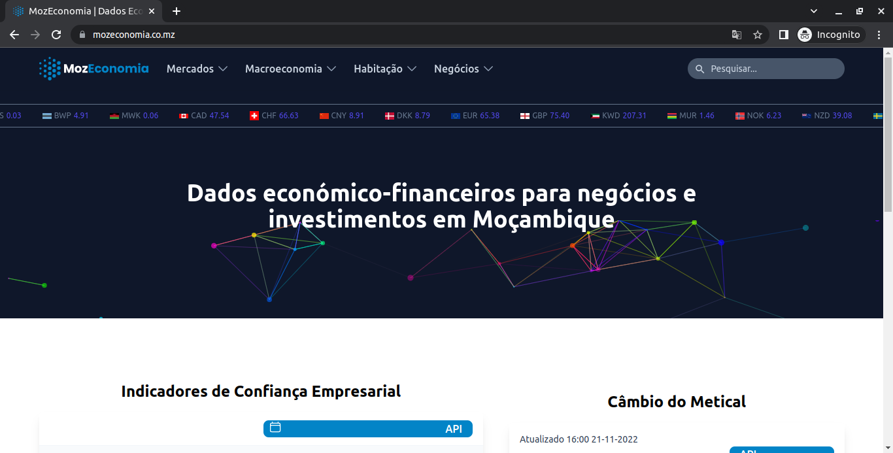

<h1 align="center">
  
</h1>

Imagine if all of us Mozambicans and Investors could have all the economic and financial information of the country, Money Market, Credit Market, Capital Market, Inflation, Exchange Rates, etc., We would make wiser decisions regarding money, right? We would know exactly where to invest and the return on the investments.

Yes, That's why we are building MozEconomia a platform to host all Mozambican financial and economic information.

<p align="center">
  

 
</p>
<p align="center">
  MozEconomia website
</p>


## Features
Pages having tables and charts to view financial and economic indicators from: 
```hs
  - Money Market
  - Credit Market
  - Capital Market
  - Exchange Rates Market
  - Housing Market
  - Inflation,
  - Business Confidence
  - Economic Activity
  - Population
  - GDP
  - Balance of Payment
```

<a align="center" target="_blank" rel="noreferrer" href="https://mozeconomia.co.mz">
  
</a>
